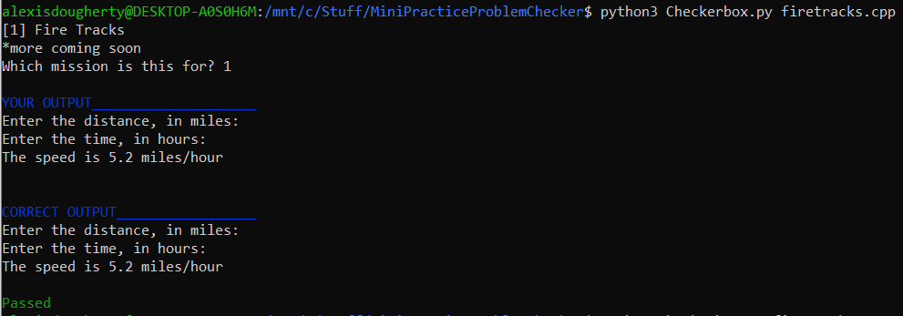

# Checkerbox and Mini Programming Missions

## Requirments
Python3 is required to run this script. You may also need to install a few modules, such as ```pip3 install colorama```.
Ubuntu terminal is the only terminal this code had been tested on. It may work on other terminals, but there is no guarantee.

## How to run

1. `cd` into the directory <br>
2. run ```python3 Checkerbox.py [path to cpp file]``` <br>
3. Pick the mission your code is on <br>
4. Terminal output lists if your output matches the exspected output <br>

## Notes
The script will be updated regularly with new examples. Directions and information on missions is located in this directory.
